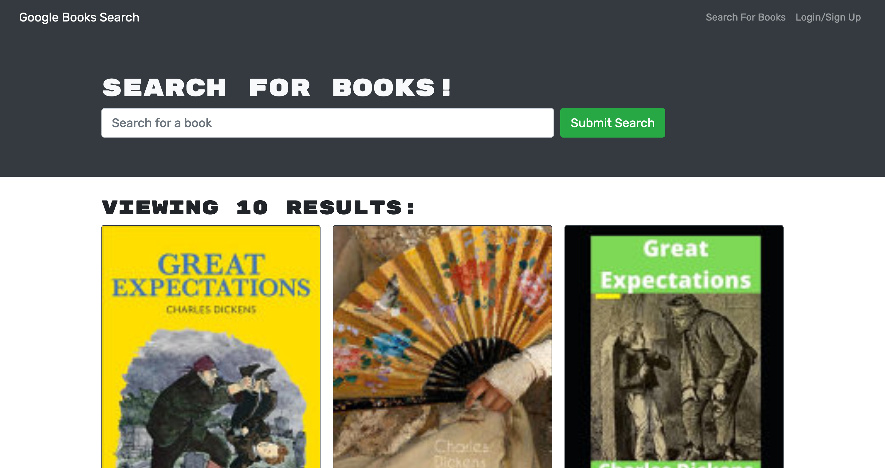

# Book Search

The Book Search application is a book search engine that allows users to search from Google Books and save books to a list of saved books. The application uses a GraphQL API built with Apollo Server, a React front end, a MongoDB database, and a Node.js/Express.js server.

[https://still-wildwood-11794.herokuapp.com/](https://still-wildwood-11794.herokuapp.com/)